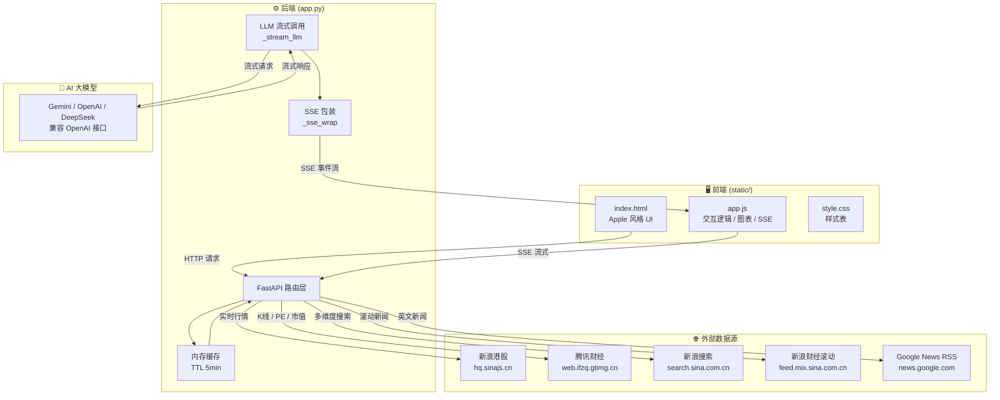
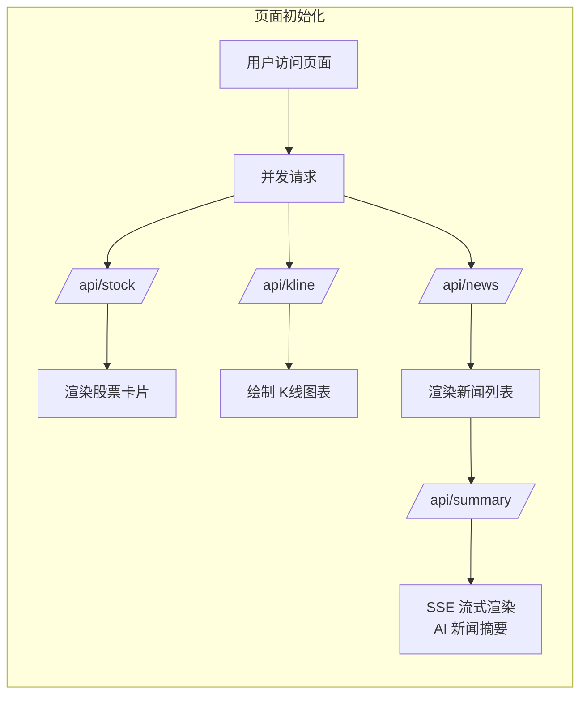
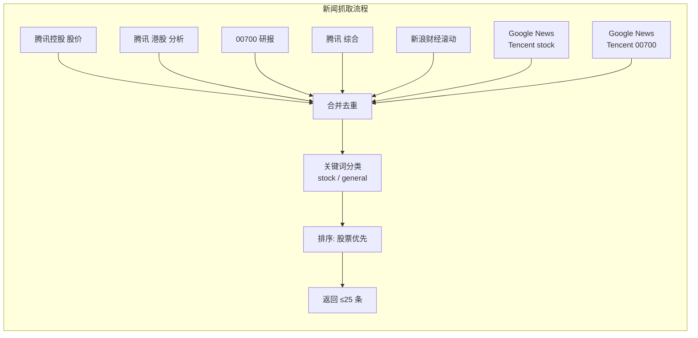
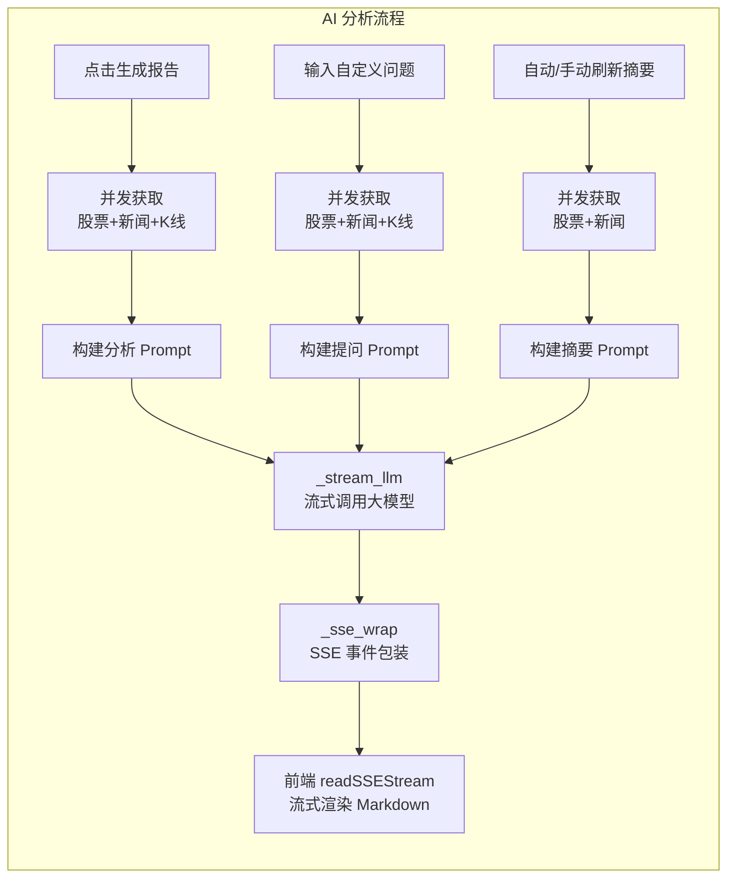
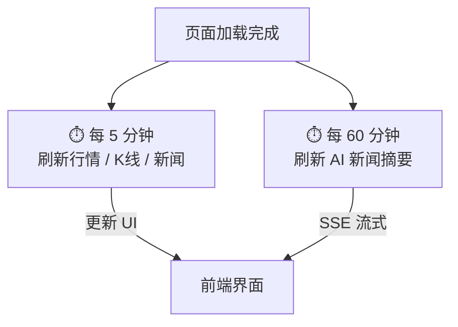

# 腾讯股票小助手 AI Agent

一个基于 AI 大模型的腾讯控股（00700.HK）实时股票分析系统。系统实时抓取中外全网腾讯相关新闻及港股行情数据，通过 AI 进行新闻摘要与深度分析，支持自定义提问。前端采用 Apple 设计风格，界面简洁优雅。


---

## 功能特性

### 📊 实时股票数据
- 实时获取腾讯控股（00700.HK）港股行情
- 展示当前价格、涨跌幅、成交量、成交额等核心指标
- 市盈率（PE）、总市值、52 周最高 / 最低等估值数据
- 数据来源：新浪港股 + 腾讯财经，双源互补确保可靠性

### 📈 K 线走势图
- 支持 **6 档时间范围**：30 日 / 60 日 / 半年 / 1 年 / 5 年 / 全部
- 支持 **3 种 K 线周期**：日 K / 周 K / 月 K
- 面积折线图 + K 线柱体组合展示（>300 条数据自动切换为纯折线+面积图）
- 鼠标悬停十字线交互，实时显示 Tooltip 详情（开 / 收 / 高 / 低 / 涨跌）
- X 轴日期标签自适应稀疏化，柱体宽度自适应
- 高 DPI 屏幕自适应，窗口缩放自动重绘

### 📰 多维度专业股票资讯（中英文）
- **国内来源**（新浪搜索 + 新浪财经滚动）：
  - `腾讯控股 股价` — 实时行情资讯
  - `腾讯 港股 分析` — 投行 / 券商分析
  - `00700 研报` — 专业研究报告
  - `腾讯` — 综合新闻补充
  - 新浪财经滚动新闻 — 财经类专业报道
- **国际来源**（Google News RSS）：
  - `Tencent stock` — 国际财经媒体报道
  - `Tencent 00700` — 港股相关英文资讯
- 智能分类：基于 60+ 中英文股票专业关键词自动标记「📈 股票」或「📰 资讯」标签
- 英文新闻额外显示「EN」标签
- 股票类新闻优先展示，自动去重，最多展示 25 条
- 点击标题可跳转原文阅读

### 🤖 AI 新闻摘要
- 基于最新抓取的全部新闻（含英文）自动生成专业摘要
- 输出三大板块：**新闻要点总结**、**市场情绪判断**、**关键关注点**
- 流式输出，带打字光标动画
- **每小时自动刷新**，也可手动点击刷新按钮
- 页面初始化时自动加载

### 🧠 AI 深度分析 + 自定义提问
- **一键生成分析报告**：综合股价、K 线、新闻等数据，输出六大板块：
  1. 市场概览 — 当前价格走势分析
  2. 技术面分析 — 基于 K 线数据的技术指标解读
  3. 消息面分析 — 根据最新新闻解读市场情绪
  4. 基本面分析 — 估值水平和业务发展评估
  5. 风险提示 — 当前面临的主要风险因素
  6. 操作建议 — 短期 / 中期 / 长期具体投资建议
- **自定义提问**：输入框支持任意问题（如「腾讯目前估值合理吗？」），AI 结合实时数据回答
- 支持回车键快捷发送
- 流式输出，实时显示分析过程
- 未配置 API Key 时自动降级为本地模板分析

### 🎨 Apple 风格 UI
- 毛玻璃导航栏（`backdrop-filter`）
- 圆角卡片式布局
- SF Pro 字体风格
- 骨架屏加载动画
- 响应式设计，适配桌面端与移动端

---

## 项目结构

```
tencent-stock/
├── app.py                 # FastAPI 后端服务（股票数据、新闻抓取、AI 分析）
├── requirements.txt       # Python 依赖
├── .env.example           # 环境变量配置模板
├── .env                   # 实际环境变量配置（需自行创建，已被 .gitignore 忽略）
├── .gitignore
└── static/
    ├── index.html         # 主页面
    ├── style.css          # Apple 风格样式表
    └── app.js             # 前端交互逻辑（图表、API 调用、SSE 流式、Markdown 渲染）
```

---

## 系统架构

### 整体架构图



### 数据流程图







### 定时任务



---

## 快速开始

### 1. 环境要求

- Python 3.9+
- pip

### 2. 安装依赖

```bash
cd tencent-stock
pip install -r requirements.txt
```

### 3. 配置 AI 大模型（可选）

复制 `.env.example` 为 `.env`，填入你的 API Key：

```bash
cp .env.example .env
```

#### Gemini（推荐）

```env
LLM_API_KEY=your-gemini-api-key
LLM_BASE_URL=https://generativelanguage.googleapis.com/v1beta/openai
LLM_MODEL=gemini-3-flash-preview
```

> Gemini API Key 可在 [Google AI Studio](https://aistudio.google.com/apikey) 免费申请。

#### OpenAI

```env
LLM_API_KEY=sk-your-openai-key
LLM_BASE_URL=https://api.openai.com/v1
LLM_MODEL=gpt-4o-mini
```

#### DeepSeek

```env
LLM_API_KEY=sk-your-deepseek-key
LLM_BASE_URL=https://api.deepseek.com/v1
LLM_MODEL=deepseek-chat
```

> 支持任何兼容 OpenAI 接口格式的大模型服务。未配置时 AI 新闻摘要和自定义提问不可用，深度分析使用本地模板生成。

### 4. 启动服务

```bash
python -m uvicorn app:app --host 0.0.0.0 --port 8000
```

开发模式（代码热重载）：

```bash
python -m uvicorn app:app --host 0.0.0.0 --port 8000 --reload
```

### 5. 访问应用

浏览器打开 [http://localhost:8000](http://localhost:8000)

---

## API 接口文档

| 方法 | 路径 | 说明 |
|------|------|------|
| `GET` | `/api/stock` | 获取腾讯控股实时行情数据 |
| `GET` | `/api/kline?period=day&count=60` | 获取 K 线数据（`period`: day/week/month，`count`: 数据条数，上限 1500） |
| `GET` | `/api/news` | 获取腾讯相关中英文专业股票资讯（最多 25 条，含分类标签） |
| `GET` | `/api/summary` | AI 新闻摘要（SSE 流式输出） |
| `GET` | `/api/analysis` | AI 深度分析报告（SSE 流式输出） |
| `POST` | `/api/chat` | 自定义提问（SSE 流式输出，Body: `{"prompt": "你的问题"}` |
| `POST` | `/api/refresh` | 清除缓存并重新抓取全部数据 |

### 响应格式示例

#### `GET /api/stock`

```json
{
  "code": 0,
  "data": {
    "name": "腾讯控股",
    "code": "00700.HK",
    "current_price": "547.500",
    "change": "-11.000",
    "change_percent": "-1.970",
    "open": "546.000",
    "high": "557.500",
    "low": "543.000",
    "prev_close": "558.500",
    "volume": "35402860",
    "turnover": "19472346757.185",
    "market_cap": "49857.2998",
    "pe_ratio": "23.79",
    "52w_high": "683.000",
    "52w_low": "413.300"
  }
}
```

#### SSE 流式端点（`/api/analysis`、`/api/summary`、`/api/chat`）

```
data: {"content": "# 腾讯控股分析报告\n\n"}
data: {"content": "## 1. 市场概览\n\n"}
...
data: [DONE]
```

---

## 数据来源

| 数据类型 | 来源 | 接口 |
|----------|------|------|
| 实时行情 | 新浪港股 | `hq.sinajs.cn` |
| 市盈率 / 市值 / 52 周数据 | 腾讯财经 | `web.ifzq.gtimg.cn` |
| K 线数据 | 腾讯财经 | `web.ifzq.gtimg.cn` |
| 国内新闻 | 新浪搜索（多维度关键词）、新浪财经滚动 | `search.sina.com.cn`、`feed.mix.sina.com.cn` |
| 国际新闻 | Google News RSS | `news.google.com/rss` |

- 数据默认缓存 5 分钟，前端每 5 分钟自动刷新行情 / K 线 / 新闻
- AI 新闻摘要每小时自动刷新
- 可手动点击刷新按钮立即更新

---

## 技术栈

**后端**
- [FastAPI](https://fastapi.tiangolo.com/) — 高性能异步 Web 框架
- [httpx](https://www.python-httpx.org/) — 异步 HTTP 客户端
- [BeautifulSoup4](https://www.crummy.com/software/BeautifulSoup/) + [lxml](https://lxml.de/) — HTML / XML 解析（新闻抓取 + Google News RSS）
- [python-dotenv](https://github.com/theskumar/python-dotenv) — 环境变量管理
- [Pydantic](https://docs.pydantic.dev/) — 请求体验证

**前端**
- 原生 HTML / CSS / JavaScript（零框架依赖）
- Canvas API — K 线图表绘制（支持日 K / 周 K / 月 K，最多 1500 条数据）
- SSE（Server-Sent Events）— 流式接收 AI 新闻摘要、深度分析、自定义提问
- 自研轻量 Markdown 渲染器

---

## 注意事项

- 股票数据和新闻均来自公开接口，仅供学习和研究使用
- AI 分析报告和新闻摘要由大模型生成，**不构成任何投资建议**
- 投资有风险，入市需谨慎，请根据自身风险承受能力做出独立判断
- 港股交易时间为工作日 09:30–16:00（北京时间），非交易时段数据为上一交易日收盘数据
- Google News RSS 需要网络可访问 `news.google.com`

---

## License

MIT
